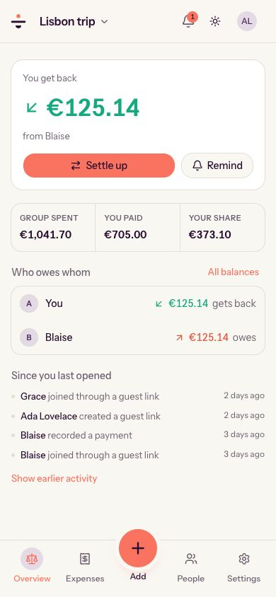

<p align="center">
  
</p>

<h1 align="center">Balancia</h1>

<p align="center">
  <strong>Shared expenses, fairly balanced — on a server you control.</strong>
</p>

<p align="center">
  A free, privacy-first expense splitter for trips, households, couples,
  families, clubs and teams. Use the hosted app or self-host it with Docker.
</p>

<p align="center">
  <a href="https://balancia.app"><strong>Try Balancia</strong></a>
  ·
  <a href="#quick-start">Self-host</a>
  ·
  <a href="./docs/compare-splitwise.md">vs Splitwise</a>
  ·
  <a href="./docs/compare-tricount.md">vs tricount</a>
  ·
  <a href="https://hosted.weblate.org/engage/balancia/">Translate</a>
  ·
  <a href="./docs/faq.md">FAQ</a>
  ·
  <a href="./docs/README.md">Docs</a>
</p>

<p align="center">
  <a href="https://github.com/sebitr/balancia/actions/workflows/ci.yml"></a>
  <a href="./LICENSE"></a>
  <a href="https://github.com/sebitr/balancia/pulls"></a>
  <a href="https://hosted.weblate.org/engage/balancia/"></a>
</p>

<p align="center">
  
</p>

Balancia is an open-source, self-hosted alternative to Splitwise and Tricount.
Add what each person paid, choose how to divide it, and Balancia calculates who
owes whom. Every feature is available without a paid tier, guests can
participate without creating an account, and a self-hosted instance keeps its
database and receipts on infrastructure you control.

## Why people choose Balancia

| Fair by design                                                                       | Your data stays yours                                                                  | Easy for the whole group                                                       |
| ------------------------------------------------------------------------------------ | -------------------------------------------------------------------------------------- | ------------------------------------------------------------------------------ |
| Equal, exact, percentage and share-based splits always add up to the original total. | Self-host with Docker Compose. No third-party service is required at runtime.          | Invite guests with a revocable link. They can participate without registering. |
| Record several payers on one bill and settle each currency precisely.                | Leave anytime: export every group as JSON, CSV or Excel. Download receipts separately. | Import an existing Splitwise CSV export or JSON backup with a preview first.   |

### A good fit for

- Friends sharing travel costs in one or several currencies
- Flatmates splitting rent, utilities and groceries
- Couples using an uneven split such as 60/40
- Families, clubs, teams and bands with recurring costs or shared income
- People who want a transparent, inspectable and self-hosted expense tracker

### Know before you choose it

- Balancia is young software maintained by a small open-source project.
- It is an installable web app (PWA), not an App Store or Play Store download.
- It shows a clear offline screen but does not accept financial entries offline.
- Self-hosters are responsible for HTTPS, updates, monitoring and backups.

See the [full project status](./docs/implementation-status.md),
[Balancia vs Splitwise](./docs/compare-splitwise.md) and
[Balancia vs tricount](./docs/compare-tricount.md) for candid decision guides.

## Features

- **Splits that always add up.** Divide an expense equally, by exact amounts,
  by percentage or by weighted shares. Money is stored as integer minor units,
  so rounding never creates or loses value.
- **Several payers on one expense.** Record the bill once even when two or more
  people paid it.
- **Multi-currency groups.** Balance currencies separately or convert into one
  base currency using a rate frozen when the expense is recorded.
- **Suggested settlements.** See the deterministic set of payments that clears
  what the group owes.
- **Recurring expenses and income.** Schedule rent, subscriptions, utilities,
  refunds, returned deposits or shared payouts in the group's timezone.
- **Guest access without an account.** A revocable invitation lets a guest view
  the group, add expenses, settle up and upload receipts.
- **Private receipt storage.** Attach images and PDFs to expenses. Files remain
  in the instance's local or S3-compatible storage behind authorization checks.
- **Splitwise migration.** Preview and import a Splitwise CSV export or JSON
  backup. Re-running the same file does not create duplicates.
- **Leave with your data anytime.** Download every group as complete JSON, broad
  compatibility CSV or an Excel workbook. Balancia does not depend on lock-in
  to keep people using it; receipts can be downloaded separately.
- **Passkeys and passwords.** Authentication is implemented in this repository;
  no third-party identity service is required.
- **Local categorization and receipt scanning.** Optional models run on the
  instance. Expense data is not sent to an external AI service.
- **English and French.** Language, date format, number format and currency
  preferences are independent. A language Balancia does not have yet is
  [a browser away](https://hosted.weblate.org/engage/balancia/).

## Quick start

### Try the hosted app

Open **[balancia.app](https://balancia.app)**. The hosted instance is free, asks
for no payment card and does not reserve features for a paid plan.

### Self-host with Docker

You need Git and Docker with the Compose plugin:

```bash
git clone https://github.com/sebitr/balancia.git
cd balancia
./scripts/bootstrap.sh
docker compose up -d
```

Open <http://localhost:3000> and create the first account.

The bootstrap script generates unique secrets into `.env`, asks whether this
host pulls Balancia or builds it, and which optional features to enable; it is
safe to run again. Docker Compose then starts PostgreSQL, applies migrations,
and launches the app — which runs its own background jobs, so that is the whole
stack: two containers, one of them the database.

Pulling is the default and the faster answer on a small server: releases are
published to Docker Hub as
[`sebitro/balancia`](https://hub.docker.com/r/sebitro/balancia) for amd64 and
arm64, so the host never runs the Next.js build. Answer no and Compose builds
from the checkout instead, which is what you want while changing the code.
Either answer is a single `COMPOSE_FILE` line in `.env`, and changing your mind
later means editing it — the database, the volumes and every other setting stay
exactly as they are.

For a public domain, upgrades, reverse proxies and production responsibilities,
read the **[self-hosting guide](./docs/self-hosting.md)**. Back up `.env`, the
database and receipt storage together; the
[backup guide](./docs/backup-and-restore.md) provides exact commands.

## Privacy and trust

Balancia has no advertising and requires no third-party runtime service.
Telemetry is off by default for self-hosted instances. If an administrator opts
in, the instance sends one anonymous, inspectable report each week; it never
contains amounts, names, receipts, group data, identifiers, IP addresses or the
instance address. Optional network integrations only run when an administrator
enables them.

Financial correctness is treated as a product requirement:

- Monetary values use integer minor units, never floating-point numbers.
- Every allocation must sum exactly to the expense total.
- Every set of balances must sum to zero or it is refused.
- Exchange rates are decimal values frozen with the expense.
- Property-based tests exercise JPY, EUR, KWD and randomized edge cases.

Read the [security model](./SECURITY.md), [telemetry design](./docs/telemetry.md),
[financial correctness notes](./docs/financial-correctness.md) and
[dependency licence policy](./docs/licensing.md).

## Documentation

Start with the **[documentation index](./docs/README.md)**, or go directly to:

| I want to…                              | Read                                                                                                                               |
| --------------------------------------- | ---------------------------------------------------------------------------------------------------------------------------------- |
| Decide whether Balancia is right for me | [FAQ](./docs/faq.md) · [vs Splitwise](./docs/compare-splitwise.md) · [vs tricount](./docs/compare-tricount.md)                     |
| Install or operate an instance          | [Self-hosting](./docs/self-hosting.md) · [Environment](./docs/environment.md) · [Backup and restore](./docs/backup-and-restore.md) |
| Move existing data                      | [Splitwise migration](./docs/data-migration.md)                                                                                    |
| Understand privacy and correctness      | [Security](./SECURITY.md) · [Telemetry](./docs/telemetry.md) · [Financial correctness](./docs/financial-correctness.md)            |
| Work on the code                        | [Development](./docs/development.md) · [Architecture](./docs/architecture.md) · [Contributing](./CONTRIBUTING.md)                  |
| Check what is complete                  | [Implementation status](./docs/implementation-status.md)                                                                           |

## Technology

Next.js 16 · React 19 · TypeScript · Tailwind CSS 4 · PostgreSQL 18 · Drizzle
ORM · pg-boss · Serwist · Vitest · fast-check · Playwright.

No Redis and no microservice fleet: one app container and PostgreSQL. Jobs are
queued in PostgreSQL through pg-boss and run inside the app; a larger instance
can move them into a worker container of their own with two lines in `.env`.

## Community and support

- Have a question? Start a [GitHub Discussion](https://github.com/sebitr/balancia/discussions).
- Found a bug? [Open a bug report](https://github.com/sebitr/balancia/issues/new?template=bug_report.yml).
- Have an idea? [Open a feature request](https://github.com/sebitr/balancia/issues/new?template=feature_request.yml).
- Want to contribute? Read [CONTRIBUTING.md](./CONTRIBUTING.md).
- Speak another language? [Translate Balancia on Weblate](https://hosted.weblate.org/engage/balancia/) — no pull request, no setup.
- Found a vulnerability? Follow [SECURITY.md](./SECURITY.md); do not open a
  public issue.

## Licence

Balancia is licensed under
[AGPL-3.0-or-later](./LICENSE). You may use, inspect, modify and redistribute it.
If you run a modified version as a network service, you must offer its users the
corresponding source code. See [the plain-language licence guide](./docs/licensing.md)
for common scenarios.

Copyright © 2026 Balancia contributors.
