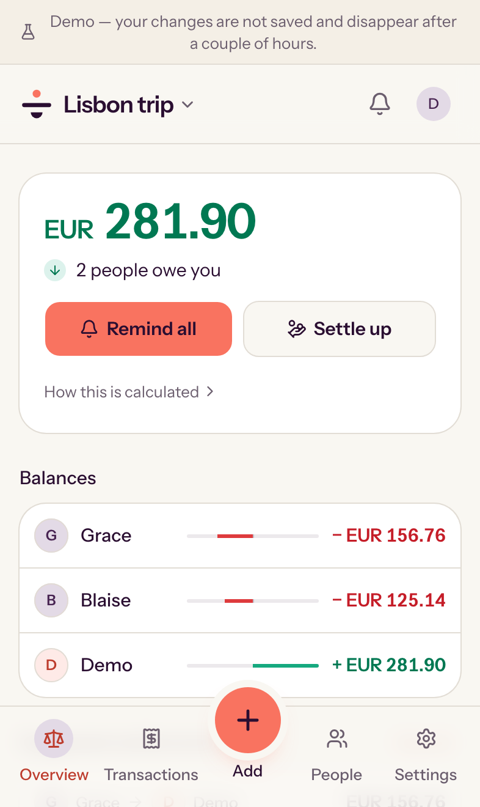
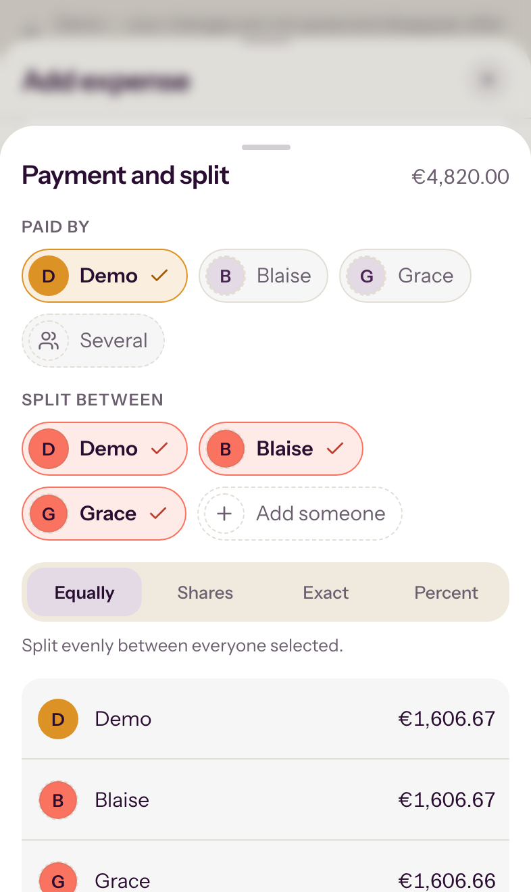
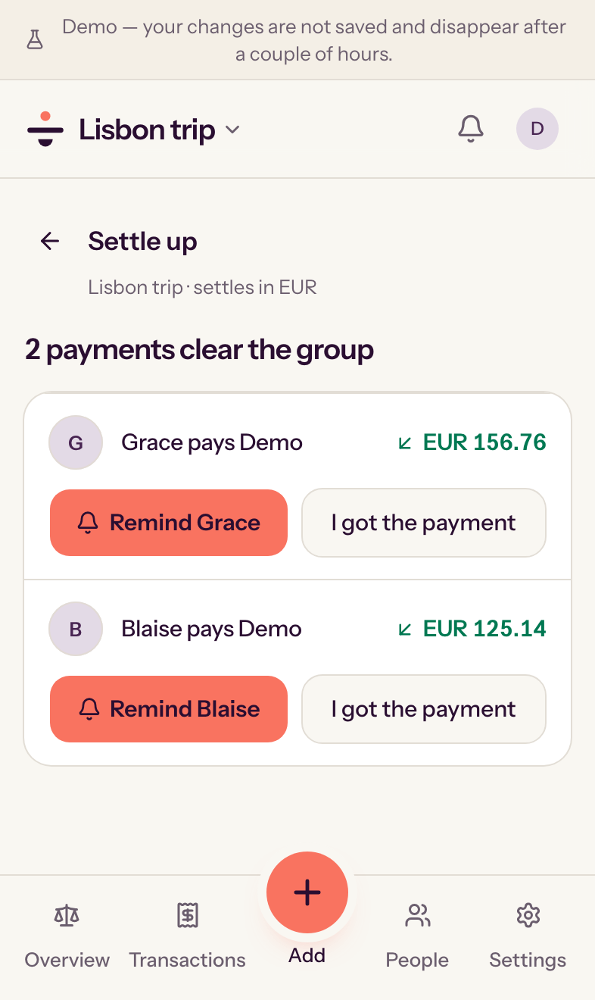
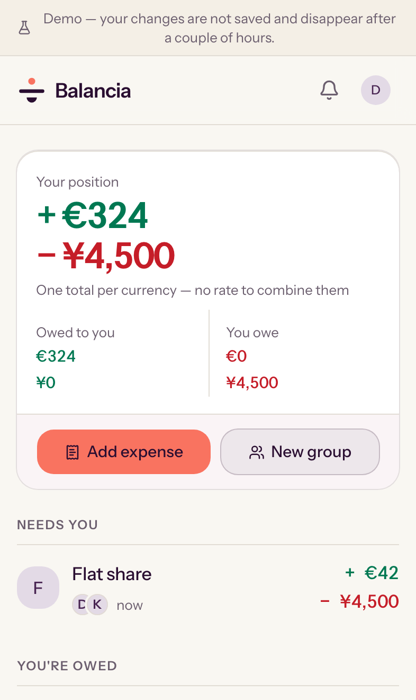
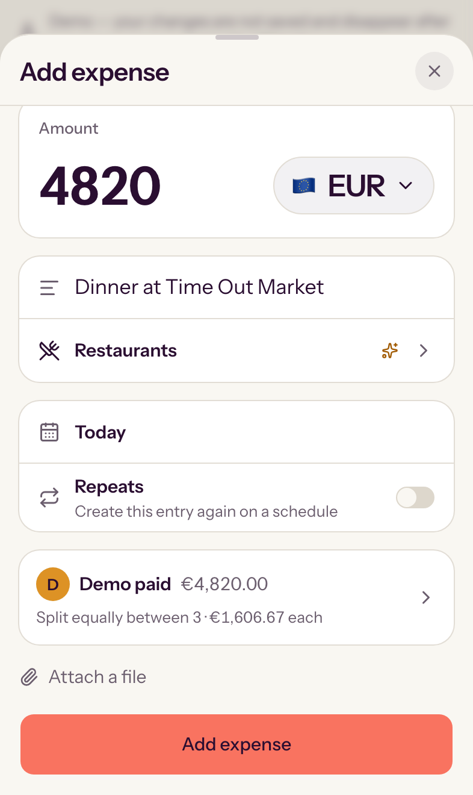
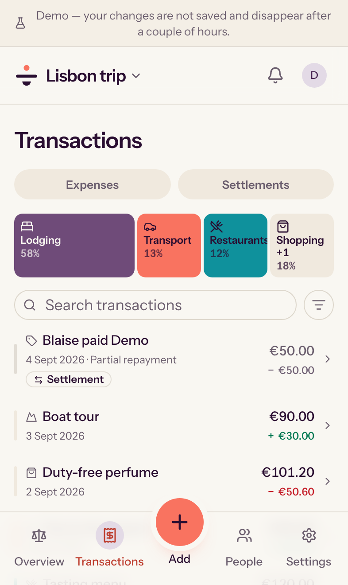
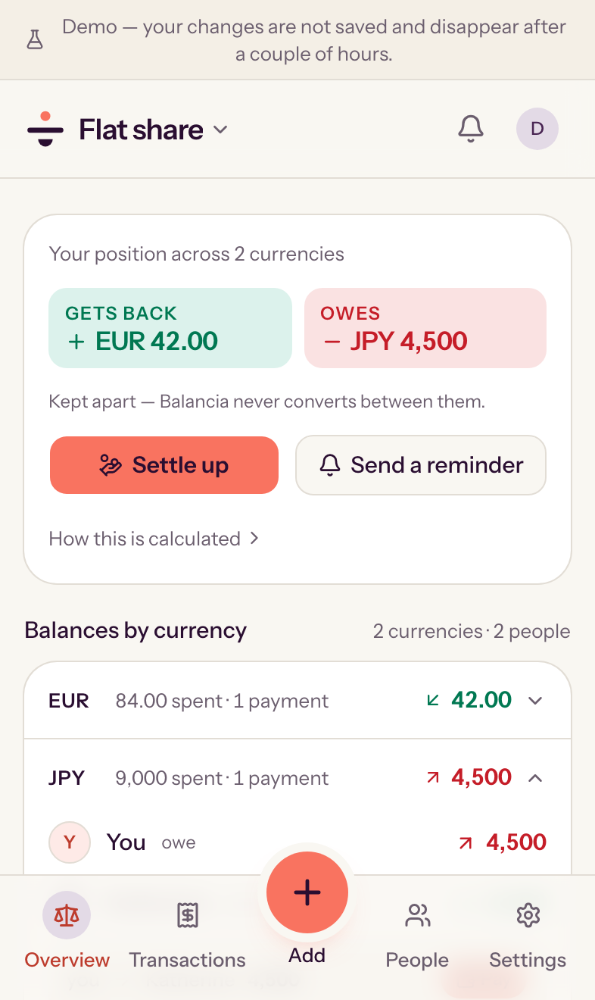
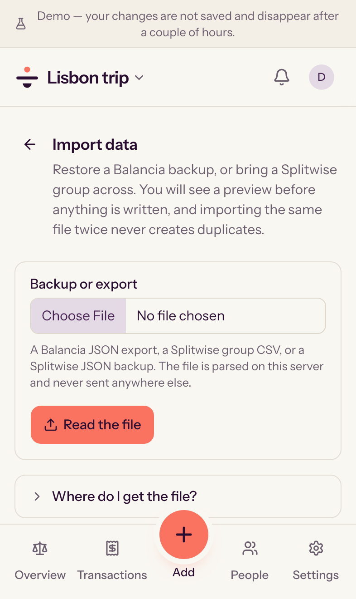
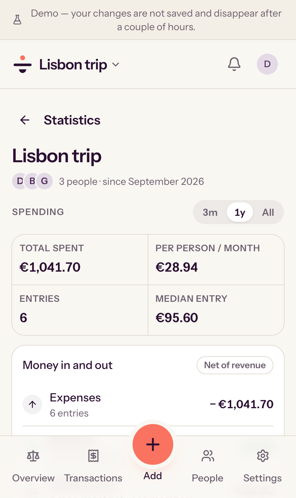

<p align="center">
  
</p>

<h1 align="center">Balancia</h1>

<p align="center">
  <strong>Shared expenses, fairly balanced — on a server you control.</strong>
</p>

<p align="center">
  A free, privacy-first expense splitter for trips, households, couples,
  families, clubs and teams. Use the hosted app or self-host it with Docker.
</p>

<p align="center">
  <a href="https://demo.balancia.app"><strong>Live demo</strong></a>
  ·
  <a href="https://balancia.app"><strong>Hosted app</strong></a>
  ·
  <a href="#self-host-with-docker">Self-host</a>
  ·
  <a href="#screenshots">Screenshots</a>
  ·
  <a href="./docs/compare-splitwise.md">vs Splitwise</a>
  ·
  <a href="./docs/compare-tricount.md">vs tricount</a>
  ·
  <a href="https://hosted.weblate.org/engage/balancia/">Translate</a>
  ·
  <a href="./docs/faq.md">FAQ</a>
  ·
  <a href="./docs/README.md">Docs</a>
</p>

<p align="center">
  <a href="https://github.com/sebitr/balancia/actions/workflows/ci.yml"></a>
  <a href="https://hub.docker.com/r/sebitro/balancia"></a>
  <a href="https://hub.docker.com/r/sebitro/balancia/tags"></a>
  <a href="./LICENSE"></a>
  <a href="https://hosted.weblate.org/engage/balancia/"></a>
  <a href="https://github.com/sebitr/balancia/commits/main"></a>
  <a href="https://github.com/sponsors/sebitr"></a>
  <a href="https://opencollective.com/balancia"></a>
</p>

<p align="center">
  <a href="https://demo.balancia.app">
    
    
    
  </a>
</p>

Balancia is an open-source, self-hosted alternative to Splitwise and Tricount.
Add what each person paid, choose how to divide it, and Balancia calculates who
owes whom. Every feature is available without a paid tier, guests can
participate without creating an account, and a self-hosted instance keeps its
database and receipts on infrastructure you control.

## Try it before you install anything

Three ways in, in order of how much they ask of you:

**[Open the live demo →](https://demo.balancia.app)** — one click, no sign-up,
no email address. You get an account of your own, already holding a Lisbon trip
that converts several currencies into euros, a flat share that keeps them apart,
one expense per split method, a multi-payer bill, a settlement and a recurring
rent template. Add expenses, settle up, break it. Two visitors never see each
other's data, and yours is swept a couple of hours later. (`demo` / `demo` if
anything asks.)

**[Use the hosted app →](https://balancia.app)** — free, asks for no payment
card, and reserves no feature for a paid plan.

**Self-host it** — Docker and its Compose plugin, and nothing else on the host:

```bash
curl -fsSLO https://github.com/sebitr/balancia/releases/latest/download/bootstrap.sh
sh bootstrap.sh
```

Full instructions, and what you take on by running it, are in
[Self-host with Docker](#self-host-with-docker) below.

## Screenshots

Every screen below is one you can reach in a click at
**[demo.balancia.app](https://demo.balancia.app)** — they were captured from
it, banner and all, rather than drawn for the occasion.

The three above are the whole loop: see where you stand, split a bill, clear
it. These are the rest.

|                                                                                        Everything, in one figure                                                                                        |                                                                                          Adding a bill                                                                                          |                                                                         What the group spent                                                                          |
| :-----------------------------------------------------------------------------------------------------------------------------------------------------------------------------------------------------: | :---------------------------------------------------------------------------------------------------------------------------------------------------------------------------------------------: | :-------------------------------------------------------------------------------------------------------------------------------------------------------------------: |
|  |  |  |
|                                    Groups sorted into the ones that need you and the ones that owe you — with one total per currency, never a made-up combined one.                                     |                                                 The category is suggested by a model on your own instance. Nothing about the expense leaves it.                                                 |                                  Where the money actually went, with settlements listed beside expenses and every entry searchable.                                   |

|                                                                           Two currencies, kept apart                                                                            |                                                                                  Coming from Splitwise                                                                                   |                                                                     What it adds up to                                                                     |
| :-----------------------------------------------------------------------------------------------------------------------------------------------------------------------------: | :--------------------------------------------------------------------------------------------------------------------------------------------------------------------------------------: | :--------------------------------------------------------------------------------------------------------------------------------------------------------: |
|  |  |  |
|                                A group can balance each currency on its own, or convert into one at a rate frozen when the expense was recorded.                                |                                A Splitwise CSV or JSON export, previewed before anything is written, and re-running the same file creates no duplicates.                                 |                             Totals per person and per month, without a spreadsheet and without anything leaving the instance.                              |

## Why people choose Balancia

| Fair by design                                                                       | Your data stays yours                                                                  | Easy for the whole group                                                       |
| ------------------------------------------------------------------------------------ | -------------------------------------------------------------------------------------- | ------------------------------------------------------------------------------ |
| Equal, exact, percentage and share-based splits always add up to the original total. | Self-host with Docker Compose. No third-party service is required at runtime.          | Invite guests with a revocable link. They can participate without registering. |
| Record several payers on one bill and settle each currency precisely.                | Leave anytime: export every group as JSON, CSV or Excel. Download receipts separately. | Import an existing Splitwise CSV export or JSON backup with a preview first.   |

### A good fit for

- Friends sharing travel costs in one or several currencies
- Flatmates splitting rent, utilities and groceries
- Couples using an uneven split such as 60/40
- Families, clubs, teams and bands with recurring costs or shared income
- People who want a transparent, inspectable and self-hosted expense tracker

### Know before you choose it

- Balancia is young software maintained by a small open-source project.
- It is an installable web app (PWA), not an App Store or Play Store download.
- It shows a clear offline screen but does not accept financial entries offline.
- Self-hosters are responsible for HTTPS, updates, monitoring and backups.

See the [full project status](./docs/implementation-status.md),
[Balancia vs Splitwise](./docs/compare-splitwise.md) and
[Balancia vs tricount](./docs/compare-tricount.md) for candid decision guides.

## Features

- **Splits that always add up.** Divide an expense equally, by exact amounts,
  by percentage or by weighted shares. Money is stored as integer minor units,
  so rounding never creates or loses value.
- **Several payers on one expense.** Record the bill once even when two or more
  people paid it.
- **Multi-currency groups.** Balance currencies separately or convert into one
  base currency using a rate frozen when the expense is recorded.
- **Suggested settlements.** See the deterministic set of payments that clears
  what the group owes.
- **Recurring expenses and income.** Schedule rent, subscriptions, utilities,
  refunds, returned deposits or shared payouts in the group's timezone.
- **Guest access without an account.** A revocable invitation lets a guest view
  the group, add expenses, settle up and upload receipts. A group's shared link
  lets a newcomer in as a guest too, and a first group can be started with just
  a name — the account comes later, when there is something to keep.
- **Private receipt storage.** Attach images and PDFs to expenses. Files remain
  in the instance's local or S3-compatible storage behind authorization checks.
- **Splitwise migration.** Preview and import a Splitwise CSV export or JSON
  backup. Re-running the same file does not create duplicates.
- **Leave with your data anytime.** Download every group as complete JSON, broad
  compatibility CSV or an Excel workbook. Balancia does not depend on lock-in
  to keep people using it; receipts can be downloaded separately.
- **Passkeys and passwords.** Authentication is implemented in this repository;
  no third-party identity service is required.
- **Local categorization and receipt scanning.** Optional models run on the
  instance. Expense data is not sent to an external AI service.
- **English and French.** Language, date format, number format and currency
  preferences are independent. A language Balancia does not have yet is
  [a browser away](https://hosted.weblate.org/engage/balancia/).

## Self-host with Docker

You need Docker with the Compose plugin. That is the whole list — no Git, no
Node, no checkout:

```bash
curl -fsSLO https://github.com/sebitr/balancia/releases/latest/download/bootstrap.sh
sh bootstrap.sh
```

Open <http://localhost:3000> and create the first account.

`bootstrap.sh` is the installer and the setup wizard in one file. It asks where
to install, fetches the Compose files for its own release into that directory,
generates unique secrets into `.env`, asks which optional features to enable,
and offers to start the stack. It is safe to run again, and every answer —
including the no's — is written down, so it never asks twice.

What starts is PostgreSQL and the app, which runs its own background jobs:
two containers, one of them the database. Migrations are applied by the app
before it serves anything.

A standalone install pulls the application from Docker Hub, where releases are
published as [`sebitro/balancia`](https://hub.docker.com/r/sebitro/balancia)
for amd64 and arm64, so the host never runs the Next.js build. To build from
source instead — which is what you want while changing the code — clone the
repository and run `./scripts/bootstrap.sh` from inside it; it then asks which
of the two you want. Either answer is a single `COMPOSE_FILE` line in `.env`.

For a public domain, upgrades, reverse proxies and production responsibilities,
read the **[self-hosting guide](./docs/self-hosting.md)**. Back up `.env`, the
database and receipt storage together; the
[backup guide](./docs/backup-and-restore.md) provides exact commands.

Want to offer the same try-before-you-sign-up demo from your own instance?
`compose.demo.yaml` runs one, with no database and nothing persisted — see
[running a demo](./docs/demo.md).

## Privacy and trust

Balancia has no advertising and requires no third-party runtime service.
Telemetry is off by default for self-hosted instances. If an administrator opts
in, the instance sends one anonymous, inspectable report each week; it never
contains amounts, names, receipts, group data, identifiers, IP addresses or the
instance address. Optional network integrations only run when an administrator
enables them.

Financial correctness is treated as a product requirement:

- Monetary values use integer minor units, never floating-point numbers.
- Every allocation must sum exactly to the expense total.
- Every set of balances must sum to zero or it is refused.
- Exchange rates are decimal values frozen with the expense.
- Property-based tests exercise JPY, EUR, KWD and randomized edge cases.

Read the [security model](./SECURITY.md), [telemetry design](./docs/telemetry.md),
[financial correctness notes](./docs/financial-correctness.md) and
[dependency licence policy](./docs/licensing.md).

## Documentation

Start with the **[documentation index](./docs/README.md)**, or go directly to:

| I want to…                              | Read                                                                                                                               |
| --------------------------------------- | ---------------------------------------------------------------------------------------------------------------------------------- |
| Decide whether Balancia is right for me | [FAQ](./docs/faq.md) · [vs Splitwise](./docs/compare-splitwise.md) · [vs tricount](./docs/compare-tricount.md)                     |
| Install or operate an instance          | [Self-hosting](./docs/self-hosting.md) · [Environment](./docs/environment.md) · [Backup and restore](./docs/backup-and-restore.md) |
| Offer a public demo of my instance      | [Running a demo](./docs/demo.md)                                                                                                   |
| Move existing data                      | [Splitwise migration](./docs/data-migration.md)                                                                                    |
| Understand privacy and correctness      | [Security](./SECURITY.md) · [Telemetry](./docs/telemetry.md) · [Financial correctness](./docs/financial-correctness.md)            |
| Work on the code                        | [Development](./docs/development.md) · [Architecture](./docs/architecture.md) · [Contributing](./CONTRIBUTING.md)                  |
| Check what is complete                  | [Implementation status](./docs/implementation-status.md)                                                                           |

## Technology

Next.js 16 · React 19 · TypeScript · Tailwind CSS 4 · PostgreSQL 18 · Drizzle
ORM · pg-boss · Serwist · Vitest · fast-check · Playwright.

No Redis and no microservice fleet: one app container and PostgreSQL. Jobs are
queued in PostgreSQL through pg-boss and run inside the app; a larger instance
can move them into a worker container of their own with two lines in `.env`.

## Community and support

- Have a question? Start a [GitHub Discussion](https://github.com/sebitr/balancia/discussions).
- Found a bug? [Open a bug report](https://github.com/sebitr/balancia/issues/new?template=bug_report.yml).
- Have an idea? [Open a feature request](https://github.com/sebitr/balancia/issues/new?template=feature_request.yml).
- Want to contribute? Read [CONTRIBUTING.md](./CONTRIBUTING.md).
- Speak another language? [Translate Balancia on Weblate](https://hosted.weblate.org/engage/balancia/) — no pull request, no setup.
- Found a vulnerability? Follow [SECURITY.md](./SECURITY.md); do not open a
  public issue.

### Support the project

Balancia is free, has no paid tier and sells nothing. The hosted instance at
[balancia.app](https://balancia.app), the demo, the translation platform and
the domains are paid for out of pocket.

<p align="left">
  <a href="https://github.com/sponsors/sebitr"></a>
  <a href="https://opencollective.com/balancia"></a>
</p>

A recurring donation pays the hosting; a one-off pays a year of a domain. Both
are welcome, and neither buys a feature — the roadmap stays in
[todo/](./todo/), in the open. If money is not what you have to give, a
[star](https://github.com/sebitr/balancia), a bug report or
[a translation](https://hosted.weblate.org/engage/balancia/) all help more than
they look like they do.

## Licence

Balancia is licensed under
[AGPL-3.0-or-later](./LICENSE). You may use, inspect, modify and redistribute it.
If you run a modified version as a network service, you must offer its users the
corresponding source code. See [the plain-language licence guide](./docs/licensing.md)
for common scenarios.

Copyright © 2026 Balancia contributors.
